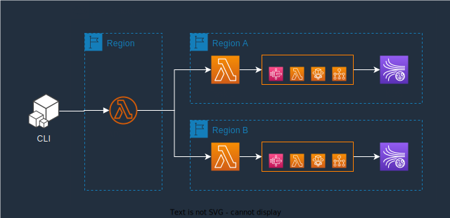

# Serverless Force Bench

SFB(Serverless Force Bench) is a tool for bench testing on AWS Serverless.



## 1. How to use it?

### 1.1 Requirements

- `node -v` >= v16.16.0
- `npm -v` >= 9.6.6
- `docker -v` >= 24.0.2
- [Setting AWS Credentials](https://docs.aws.amazon.com/sdk-for-javascript/v2/developer-guide/setting-credentials-node.html)

### 1.2 Install the CLI

```bash
npm i -g sfb
```

### 1.3 Show Help Options

```bash
sfb help
```

## 2. Stack

Before using CLI, you need to first deploy the base stack in your chosen region.

> **Permissions**: Managing stacks usually requires administrator permissions.

### 2.1 Deploy/Update

```bash
# deploy a new stack or update stack
sfb deploy

# deploy a new stack or update stack in specify region
sfb deploy --region <your-region>
```

### 2.2 Remove

```bash
# remove the stack
sfb remove

# remove the stack in specify region
sfb remove --region <your-region>
```

### 2.3 List Deployed Regions

```bash
sfb regions
```

## 3. Tasks

> **Permissions**: Using the CLI usually requires ordinary permissions:
> - lambda:invokeFunction
> - ec2:describeRegions
> - cloudformation:describeStacks

### 3.1 Create Task

```bash
# show how create a new task
sfb create --help

# create a new task in current region
sfb create --name test --type API --n 10 --c 2 --compute Lambda --url https://api.com

# create a new task in specific region(s)
sfb create --name test --type API --n 10 --c 2 --compute Fargate --delay 30 --url https://api.com --regions ap-southeast-1,us-east-2

```

### 3.2 List Tasks

```bash
# list all tasks
sfb ls

# show a specific task detail
sfb ls [taskId]

```

### 3.3 Remove Tasks

```bash
# remove all tasks
sfb rm

# remove a specific task
sfb rm [taskId]

```

### 3.4 Abort Task

```bash
# abort a specific task
sfb abort <taskId>
```

# 4. How to compute the cost?

- https://aws.amazon.com/lambda/pricing/
- https://aws.amazon.com/step-functions/pricing/
- https://aws.amazon.com/sns/pricing/
- https://aws.amazon.com/ecs/pricing/
- https://aws.amazon.com/batch/pricing/
- https://aws.amazon.com/kinesis/data-streams/pricing/
